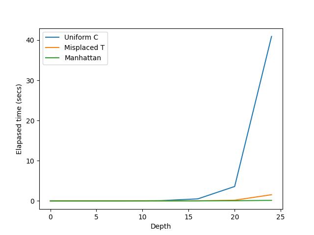
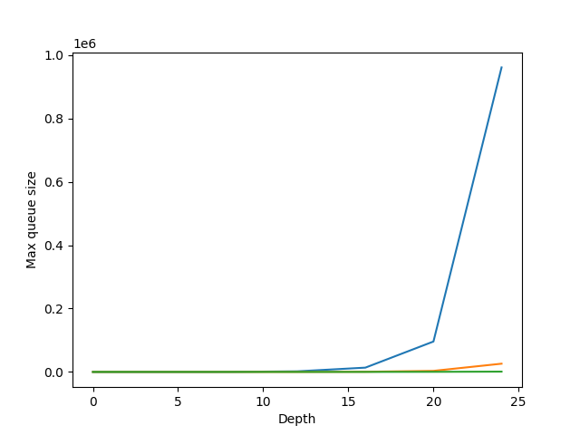

# N-Puzzle

A sliding tile puzzle is a mechanical toy with an $n \times n$ grid, where $n=2,3,4,\dots$, and each tile on the grid has a number printed on it. There are $n^2 - 1$ numbers and one blank position for an empty tile. The goal of this puzzle is to start from any random arrangement and slide the tiles using this empty tile and reach the goal state.


<!--  -->

## Getting Started

### Dependencies
- [Matplotlib](https://matplotlib.org/)
- [NumPy](https://numpy.org/)

Ensure you have these libraries installed to run the code successfully. You can install them using pip.


### Executing program

Run the following commands to execute the program

##### Uniform cost search
```
python3 main.py
```

##### A* with Misplaced Tiles heurisic
```
python3 main.py --algorithm a_star --heuristic misplaced_tile --initial_state "5,0,2,8,4,7,6,3,1"
```

##### A* with Manhattan Distance heurisic
```
python3 main.py --algorithm a_star --heuristic manhattan
```

## Help

For more information and debug commands run with
```
Run command with python3 main.py --help for helper info
```

## Authors

Nebiyou Yismaw

## Acknowledgments


* [README Template](https://github.com/matiassingers/awesome-readme)
